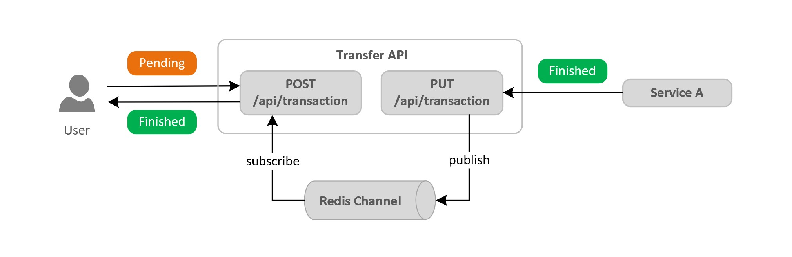

# Pub-Sub pattern for synchronous REST API responses

This repo contains a Java Spring REST API sample that uses the Pub-Sub pattern to interface *synchronous* REST API responses and asynchronous messaging brokers.

## Prerequisites

- Java 8 or higher + Maven
- [Docker](https://docs.docker.com/install/), if you want to run the REST API as a container
- Redis (local or hosted in another environment)

## Getting Started

### **1. Redis setup**

If you don't have an existing Redis and would like to run it locally, one way is following the tutorial described [here](https://redis.io/topics/quickstart) to download and compile Redis. Another way is running as a Docker container:

    docker run --name my-redis -p 6379:6379 -d redis

### **2. Run the REST API**

You can run the application on your preferred IDE or text editor (e.g. VS Code, IntelliJ, Eclipse). If you want to run as a Docker container:

First build the image:

    docker build -t observer-api .

Then run the application:

    docker run --name observerapi -p 8080:8080 -d observer-api

Now you can access the Swagger documentation on `http://localhost:8080/swagger-ui.html`.

